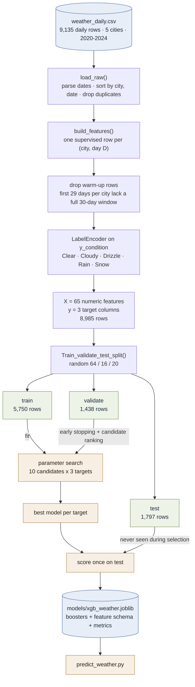
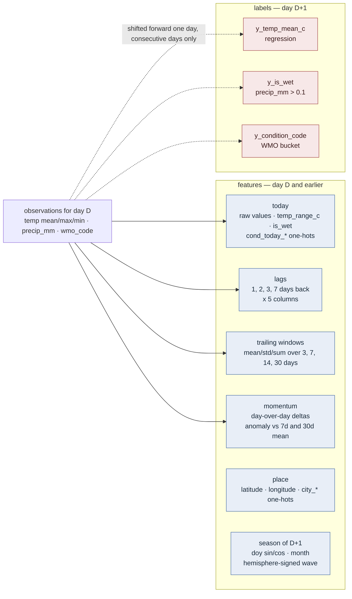
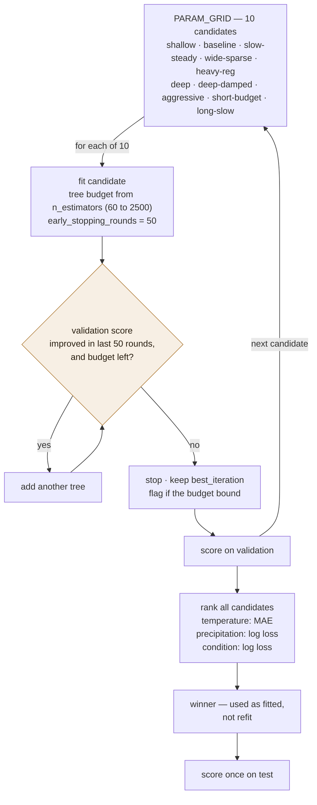
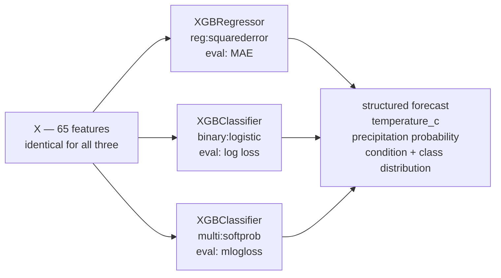

# weather-predict

Next-day weather forecasting with XGBoost, trained on five years of daily
observations for New York, London, Tokyo, Sydney and São Paulo.

| file | role |
| --- | --- |
| `fetch_weather.py` | pull daily history from the Open-Meteo archive into `weather_daily.csv` |
| `xg.py` | build features, search parameters, train and save the three models |
| `predict_weather.py` | load the bundle and serve a structured forecast |
| `train_validate_test_split.py` | the 64/16/20 split helper |
| `config.py` | paths and thresholds shared by training and serving |
| `conftest.py` | synthetic fixtures — no test touches the real CSV |

```console
$ pip install -r requirements.txt
$ python fetch_weather.py                 # writes weather_daily.csv
$ python xg.py                            # search + train, ~2 min
$ python predict_weather.py --city "New York" --date 2024-12-31
```

# XGBoost training process

How `xg.py` turns `weather_daily.csv` into the three next-day models that
`predict_weather.py` serves.

## End to end



## Feature construction

Every feature describes day `D` or earlier; every label describes `D+1`. That
boundary is the whole point of the function — nothing that would be unknowable
at forecast time may enter the matrix.



Calendar dates themselves are excluded. A split on `date > 2023-06-01` carves up
the training calendar and cannot transfer to any future day, so seasonality is
supplied only through cyclical encodings that repeat every year.

## The parameter search

`search()` runs once per target. Each candidate is fitted on train, early-stopped
on validation, and ranked by a single validation metric. All three metrics are
lower-is-better.



The winner is kept exactly as fitted rather than refit on train + validation:
refitting would discard the early-stopping set that chose its tree count.

## Three targets, one feature matrix



Sharing one matrix and one split means the three targets are trained and scored
on exactly the same rows, so their metrics are directly comparable. Each target
picks its own winning configuration independently.

## What gets reported

| stage | output |
| --- | --- |
| per candidate | selection metric, trees used vs. budget, wall-clock seconds |
| per target | full candidate table sorted best-first, winner marked |
| winner | validation score sampled across boosting rounds |
| winner | validation and test scores against a naive baseline |
| winner | top features by gain |

Baselines the models are measured against: persistence ("tomorrow looks like
today") for temperature, and the majority class for both classifiers.

## Tests

```console
$ python -m pytest -q
```

104 tests, ~8 seconds. Everything runs on synthetic observations built in
`conftest.py` — `weather_daily.csv` is gitignored and comes from a network
call, so no test may depend on it. The end-to-end fixture trains the real
pipeline on that synthetic data with a two-candidate grid.

The load-bearing ones guard the D / D+1 boundary: that every `y_*` column
equals the next day's observation, that no `y_*` column reaches
`feature_names()`, that a gap in the record suppresses labels rather than
silently forecasting two days ahead, and that the bundle `xg.py` writes still
splats cleanly into `WeatherPredictor.__init__`.
